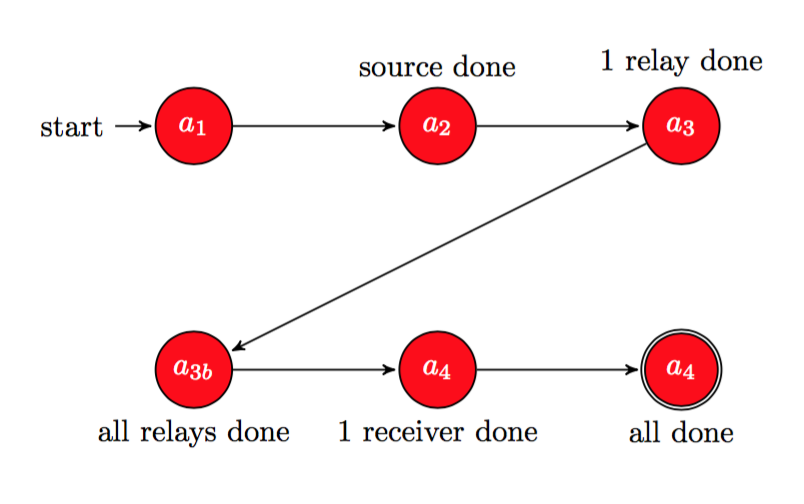
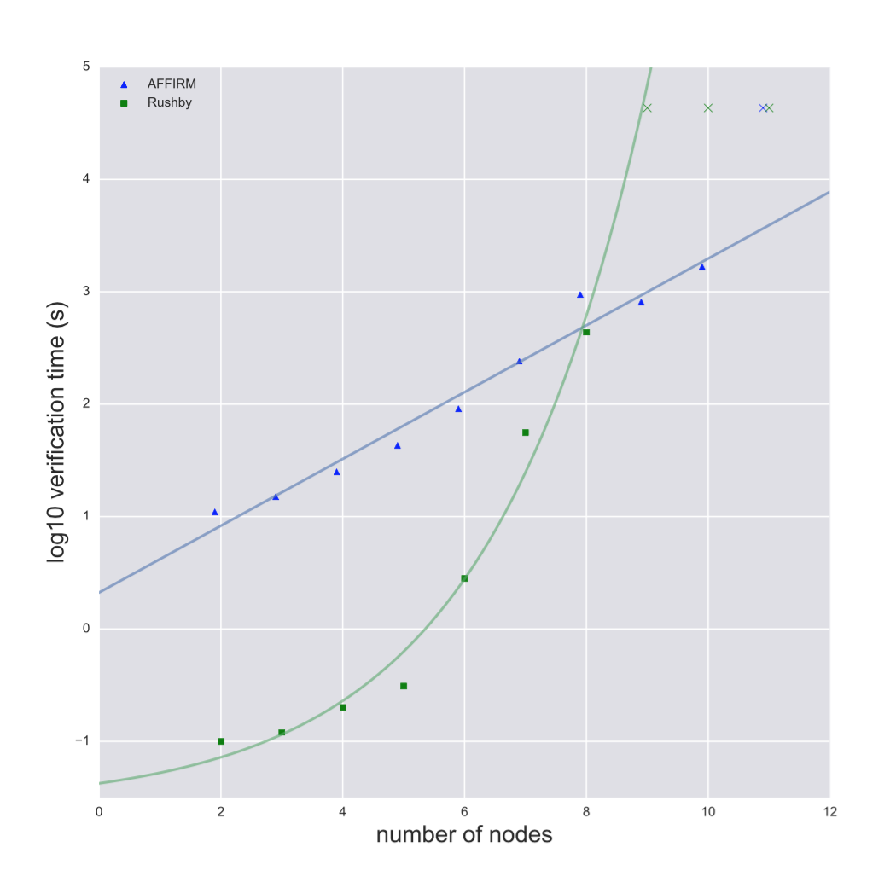

% AFFIRM Progress Report
% Lee Pike and Benjamin Jones
% April 13, 2016

# AFFIRM Progress Report

## Improving and Benchmarking Our OM(1)

 * Inductive proof of agreement
 * Hybrid fault model
 * Benchmarking against Rushby's OM(1)


# Inductive proof of agreement

## Proof

We completed an inductive *proof of agreement*.

```
```

The proof was accomplished using two techniques not required for the *proof of
validity*:

 1. a coarse abstract state machine
 2. history variables at points relevant to data flow


## Abstract State Machine




## History Variables

 * History variables help the model checker reason about data flow

 * They can be generated automatically as instrumentation that is useful in
   verification

Here is a part of the state predicate characterizing the abstract state `a3`.

```
FORALL (i: RELAYS, j: RECEIVERS):
     (    NOT relays_done[i]
      AND null?(cal, chan(i,j))
      AND buffers[j][i] = missing)
```

----

In this piece, the relay is done, but the receiver has not read the channel.

```
  OR (    relays_done[i]
      AND cal.msg[chan(i,j)] = latches[i]
      AND buffers[j][i] = missing)
```

----

The relay is done, the receiver has read the channel, and the
message read matches the value in `latches[i]`.

```
  OR (    relays_done[i]
      AND null?(cal, chan(i,j))
      AND buffers[j][i] /= missing
      AND (NOT is_faulty?(f[i]) => buffers[j][i] = latches[i]))
```


# Hybrid Fault Model

## Hybrid Fault Model

In order to fairly compare Rushby's OM(1) and our calendar-based model, we enriched the fault model to include *symmetric* and *manifest* faults.

 * Possible fault types for nodes are: non-faulty, byzantine, symmetric,
   and manifest

 * Maximum fault assumption is now an inequality between the weighted sum of
   faulty components and the number of relays

For example, the n-relay system tolerates:

| n=3                     | | n=4                                |
|-------------------------+-+------------------------------------|
| 1 byzantine fault       | | 1 byzantine & 1 manifest fault     |
| 1 symmetric fault       | | or 1 symmetric & 1 manifest fault  |
| up to 2 manifest faults | | or up to 3 manifest faults         |


# Benchmarking Against Rushby's OM(1)

## Parametrization

To compare the scalability of verification for Rushby's model and our
calendar-based model, we parametrized both models over the number of relays
and receivers.

 * The largest of Rushby's models we've been able to check has 8 nodes

 * The largest calendar-based model we've been able to check has 10 nodes

 * Adding receivers increases the complexity of model checking much more than
   adding relays

 * We see clear indication of *single exponential* time complexity for the
   calendar-based model (and induction proof) versus *double exponential* time
   complexity for Rushby's model (and symbolic proof)


## Benchmark



